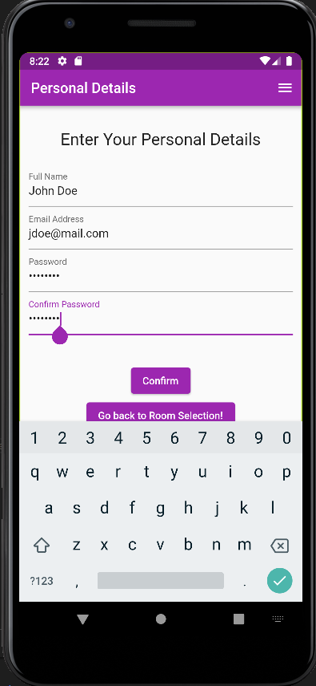
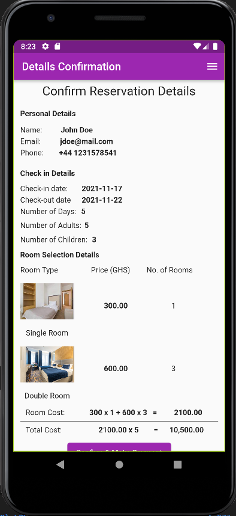
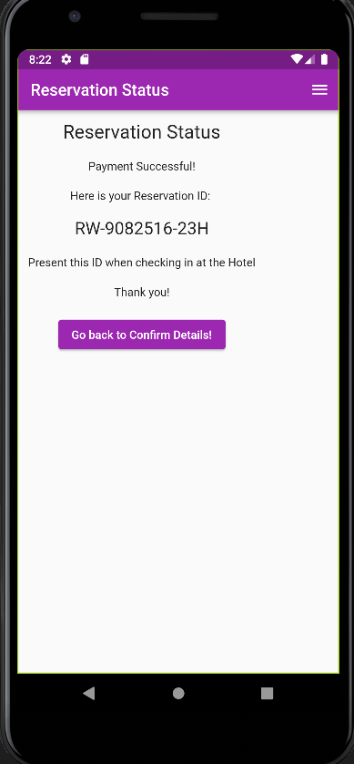

# RestWell Hotel Rervation App


### Built with

- Flutter
- Dart

### Prerequisites
1. Make sure flutter sdk and all dependencies are installed.
[See flutter installation guide](https://docs.flutter.dev/get-started/install)
### Getting Started 
These instructions will get you a copy of the project up and running on your local machine for development and testing purposes.

### 1) Clone the repository
```
git clone https://github.com/jwelbeck52/RestWell-Hotel.git
cd RestWell-Hotel/
```

### 2) Install Package Dependencies
```
flutter pub get
```
### 3) Running the project
```
flutter run
```

### Screenshots

   

 

#### Flutter Widgets used
- named routes and navigator
- scaffold
- listview
- appbar
- drawer, endDrawer
- column, row
- singleChildScrollView
- Image.asset
- elevatedButton
- sizedbox
- datetime
- text

## Author
Joshua Nii Okai Welbeck
- LinkedIn - [Joshua Welbeck](https://www.linkedin.com/in/jwelbeck38)
- Frontend Mentor - [@jwelbeck52](https://www.frontendmentor.io/profile/jwelbeck52)
- Twitter - [@jwelbeck38](https://www.twitter.com/jwelbeck38)
